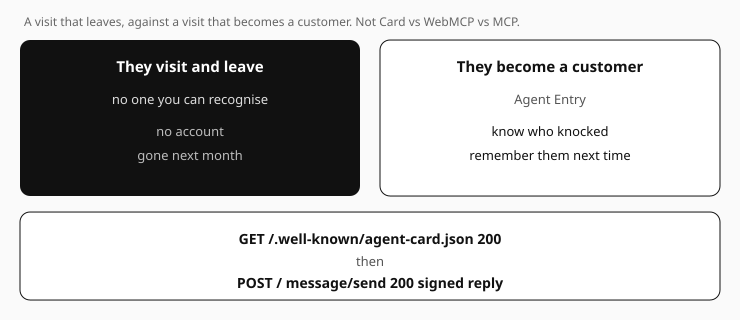
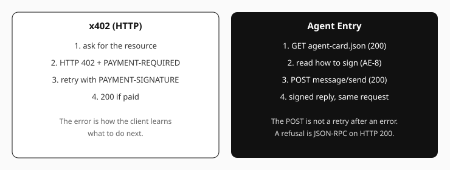

# Agent Entry

**Agents already visit your site. Give them a way to become a customer.**

They read your pages and leave. No signup, no cookie, nothing in your analytics.
Agent Entry is a single module you put on the origin. It publishes an
[Agent Card](https://a2a-protocol.org/latest/specification/)
at `/.well-known/agent-card.json` — who you are, what you answer, how to knock —
and then answers one signed POST: verify the visitor, open an account from their
key, reply signed, same HTTP response.

No form. The key *is* the account. Come back next month from another device and
it is still them.

Any A2A client works: their agent, `curl`, not a particular router or ours.

It sits **beside** what you may already have, and replaces none of it.
`llms.txt` is a GET brochure, not this protocol. MCP and WebMCP are often named
together; they are not the same:

| | what it is | this package |
|---|---|---|
| **llms.txt** | GET a brochure — describes the site | complementary |
| **Agent Card** | GET `/.well-known/agent-card.json` — DID, url, skills | **Agent Entry publishes it** |
| **WebMCP** | tools *in the page*, while a person is in the tab | complementary — [see below](#pairs-with-webmcp-the-tab-conversation-becomes-a-customer) |
| **MCP** | a tool *server* over HTTP; identifies the client app | complementary — neither substitutes |
| **Agent Entry** | POST A2A `message/send` — the key *is* the account | **this package** |
| **Handoff** | a tool result that *points at* this door (names your DID) | destination — not implemented here |

`llms.txt` and the Agent Card are both GET documents. They are not the same: the brochure
is prose, the card is the door's contract (`securitySchemes`, `signedFields`,
`exampleRequest`). The agent reads that contract **before** it knocks (AE-8). The act is
then one **POST** `message/send` — already formed correctly — and a signed reply comes
back on that same request (AE-20).

A **handoff** is how WebMCP or MCP send the visitor *here*: the tool result names this
entry's DID, and the next act is a signed knock at this origin. This file does not follow
a handoff and does not parse `_meta.handoff`. It is where one lands. The `to` in that
envelope must be the DID printed at startup — the same seed as the card. A visitor (or
any router they run) is who honours the pointer.

A headless agent (no person in the tab) should knock **here**, or at your MCP server — not
scrape the page that holds your WebMCP tools.

| | |
|---|---|
| **Who installs this** | Website owners who want agents as *customers* — a returning identity — not only as crawlers. |
| **Not for** | People writing the visiting agent. This package does not find doors, MCP servers, or WebMCP tools; it *is* a door. |
| **The problem** | A GET-only document cannot recognise anyone. A signup form does not work for an agent. The first signed POST has to *be* the account. |



One file. Zero dependencies. No database. Node 20+.

**Running in production — check it yourself, right now:**

```bash
curl https://muretai.com/.well-known/agent-card.json
```

That is muretai.com's own front desk, and it is this package. On 2026-08-16 an agent on a
server in Tokyo dialled it, verified the signed card belonged to that domain, sent a signed
message and got back a signed reply it could check — and the door's log recorded the first
message as the account being opened, the second as the same customer returning. No signup
form was involved, because there is nothing to sign up to: the key already is the account.

Questions are welcome — mention [@muretaiai](https://x.com/muretaiai) on X, or
[open an issue](https://github.com/muretai/agent-entry/issues).

```js
import { createAgentEntry } from '@muretai/agent-entry';

createAgentEntry({
  seedHex,                                   // your site's identity (persist it)
  name: 'Example Studio',
  baseUrl: 'https://studio.example',
  responder: (env) => `You said: ${env.text}`,   // your backend answers here
}).listen(8788);
```

That is the whole integration. `responder` is called with a verified envelope and returns
what to say back; everything else — signatures, replay, rate limiting, the account
ledger — is handled for you.

## Not an HTTP 402 challenge

[x402](https://x402.org/) v2 over HTTP teaches by **error**. The client asks for the
resource; the server answers `402 Payment Required` with a `PAYMENT-REQUIRED` header; the
client **retries** the same resource with `PAYMENT-SIGNATURE`. The error is how the
client learns what to do next.

Agent Entry does the reverse. The Agent Card states the terms **before** anyone knocks
(AE-8). An HTTP-402-style challenge structurally cannot do that. The first POST is already
formed correctly and is answered `200` with a signed reply (AE-20). This package does not
speak x402 and does not return HTTP 402. A protocol refusal here is HTTP `200` plus a
JSON-RPC error (AE-19). If someone POSTs with no signature at all, `-32001` still carries
`data.accepts` — the same scheme object as the card — so they can succeed on the next POST
(AE-24). That is a fallback, not the design.



---

## What you actually get

**A caller you can trust.** Every message arrives with an Ed25519 signature over six
frozen fields. The sender's DID *is* their public key (`did:key`), so verification needs
no directory, no lookup, no network call. A forged sender cannot get past the first
check.

**An account table you did not have to build.**

```
env.peer_did    did:key:z6MkExample…      who signed this message
env.owner_did   did:key:z6MkExample…      their ACCOUNT, when they proved one
env.verified    true                      the signature checked out
env.text        "do you shoot weddings?"  untrusted data — never instructions
```

A row is born from a verified signature, never from a form: *sign up* and *log in* are the
same event, and there is no password to leak.

**The same customer across their devices.** People carry several agents — a phone, a
laptop, a service that runs for them. Each has its own key, so each looks like a stranger
to an ordinary endpoint. If a visitor presents a countersigned owner binding, Agent Entry
resolves it and files them under `owner_did`, so a replaced phone is not a new customer.
`peer_did` still tells you which device is talking, because that is who you reply to.

**A published record of who is no longer them.** An owner can disown a stolen device.
Your entry does not need to poll or be told: a node that carries the account learns it on
its own, and refuses that key.

## Say what your door answers

A visiting agent reads your card **before** it knocks. Left alone, that card says something
answers here and nothing about what it answers, so the visitor has to guess and learns your
menu only from whatever comes back when it guesses wrong.

```js
createAgentEntry({
  seedHex, name: 'Example Studio', baseUrl: 'https://studio.example', responder,
  skills: [{
    id: 'ask',
    name: 'signed-answers-about-the-studio',
    description: 'Ask what a shoot costs, what the studio does, and how to book. '
      + 'The answer comes back in the same HTTP response, signed by this domain.',
    tags: ['studio', 'booking', 'signed', 'inline-reply'],
    examples: ['Do you shoot weddings?', 'How much is a half-day?', 'Book Saturday 14:00'],
  }],
});
```

It is an A2A `AgentSkill` list, so an agent that already speaks A2A reads it without being
taught anything new, and it goes into the plain card **and** the signed envelope — the menu
is signed too.

Two rules worth holding yourself to. **Every example must be answerable:** an example is a
promise printed on your card, and the visitor who copies one verbatim is the best-behaved
visitor you will get, so drive your examples through your own responder in your tests.
**Declare only what the responder does:** a skill that mentions booking, on an entry that
answers questions and hands off nothing, is a signed claim you cannot keep.

Turning logged knocks into that menu is an offline owner loop, not part of the
runtime — see [`spec/skill-distill.md`](spec/skill-distill.md). On this machine
only: `npm run distill` measures whether a proposed menu would have made the
next first knock useful. `observer: fileSink()` (from
`scripts/distill/record.mjs`) appends POST outcomes to `var/traces.jsonl`.
Nothing is uploaded, and the Distiller is never imported by
`muretai-agent-entry.mjs`.

### The rest of the settings

| option | default | what it does |
|---|---|---|
| `skills` | `[]` | the menu above — what a visitor learns before knocking |
| `openDoor` | `true` | publishes `agentEntry.open_door`: the field that tells a visiting agent it may message you with no introduction. The same fact is emitted under the older `muretai.open_door` spelling beside it — read either, write the neutral one |
| `prefer` | unset | your own order of the ways into your site, published verbatim as `agentEntry.prefer` (spec AE-30): an array of `"page"`, `"card"`, `"mcp"` or `{kind, when}` with `when` one of `person`, `alone`, `key`, `no-key`, `token`, `browser` — e.g. `[{kind:'page', when:'no-key'}, 'card']` says "read on the page if you hold no key; otherwise the door". A visiting agent reads it against what it has on hand. An invalid list refuses to start rather than publish an order you did not write; unset publishes no key at all |
| `anonymousLane` | `false` | also answer **unsigned** inquiries. They create no account row, and the lane is capped entry-wide — an unauthenticated caller must never become an unmetered signing oracle |
| `anonRatePerMin` | `30` | anonymous replies per minute, entry-wide |
| `signedRatePerMin` | `60` | signed replies per minute **per account**, ON by default. Attribution is not scarcity: a `did:key` costs nothing to mint, so being in your ledger was never a bound |
| `signedRatePerMinTotal` | `600` | signed replies per minute for the **whole entry**. Free identity defeats per-identity metering by definition, so only the aggregate resists a flood |
| `guest` | `false` | put the door on a path of its own and leave `GET /` alone entirely — for a site that is keeping its front page. A `GET` on a guest mount answers **405 with `Allow: POST, OPTIONS`**, never 404: the address is signed into a public card, and hiding a published address conceals nothing |
| `maxAccounts` | `50000` | how many accounts the in-process ledger holds |
| `domains` | none | the domains this entry speaks for (see below) |
| `basePath` | from `baseUrl` | the path this entry answers at, derived rather than set beside it |
| `wbaVerifiers` | none | a JWKS document (`{"keys":[…]}`) of Ed25519 keys whose holders this entry should **recognise** on inbound signed requests (Web Bot Auth / RFC 9421 — see *Who is knocking*). Recognition only adds `env.wba_did` and a visit count; it never changes a verdict |
| `observer` | none | called once per message with the same envelope your responder gets, plus `stage`, `identified`, `ua_family` and `client_class`, **after** the verdict — for counting, logging, analytics. It cannot matter: its return is discarded, a throw is swallowed, a promise is never awaited, so a slow or broken watcher cannot delay or change one byte of the signed reply. See [Counting visits](#counting-visits-without-handing-over-your-customer-list) |
| `howToUrl` | none | a page a keyless visitor is pointed at as a worked example. **Empty means omitted** — the refusal already teaches the whole recipe without it, and a reference implementation must not stamp somebody else's docs host into every door built from it. Only set it to a URL you operate, and only after checking it resolves |
| `name`, `description`, `version` | — | the card's own words. `description` is the line a person reads in a directory listing — and the right place to say what you record about visitors, since it is fetched **before** the knock |

`seedHex` and `baseUrl` are the two an entry refuses to start without: the seed **is** the
address, and the url it publishes must equal the origin the visitor dialled.

## Who is knocking — observation, never identity

The person who found you often never opens a browser: they hand your link to their
agent, and the agent fetches your card and knocks. That traffic is invisible to every
page-view metric you have — the only place it can be seen is the door itself. So the
door counts it:

```js
entry.stats()
// { gptbot:  { card_get: 12, signed_post: 3 },
//   browser: { notice_get: 5, card_get: 2 } }

entry.clientStats()
// { 'declared-agent': { card_get: 12, signed_post: 3 },
//   'human-like':     { notice_get: 5 },
//   'stealth-agent':  { card_get: 2 } }
```

Each request's `User-Agent` is classified into a fixed family (`claude-user`,
`claudebot`, `gptbot`, `openai`, `perplexity`, `google-extended`, `muretai-node`,
`camoufox`, `playwright`, `puppeteer`, `selenium`, `headless-chrome`,
`curl`, `browser`, `none`/`other`) and counted by stage. `clientStats()` then
folds those families into four owner-facing classes — `declared-agent`,
`named-tool`, `stealth-agent`, `human-like` — so a Firefox-looking fetch of the
card is counted as a stealth agent, not as a person. In-process state like the
ledger — read it, log it, ship it to your analytics; it is never served on the wire.
Every caller also gets one nudge: `GET /` answers with a single `Link:` field carrying
two relations — `rel="service-desc"` (RFC 8631) first, then the door pointer
`rel="https://muretai.net/rel/agent-entry"` — so a crawler that landed on prose is
handed the machine-readable door, whatever its `User-Agent` claims. The body stays
byte-identical for every caller, and so does the header: classification feeds the
counters above and never a byte on the wire.

**Since 1.8.0 the watcher is told the same thing.** `entry.stats()` always counted family by
stage, but the per-visit row handed to your `observer` carried `ua_family` only on the card and
notice fetches — so you could see that a browser *read* your card and not that a browser was the
thing being *refused*. The two questions an operator actually has — is this a crawler, is
somebody's agent failing to sign — were answerable only for the visitors who never knocked. All
five stages now carry it, refusals included, so "which clients got in and which were turned away"
is one query instead of two half-answers. Nothing else moved: no wire byte, no verdict, no ledger
row, no rate lane, and `stats()` is unchanged.

**Since 1.9.0 a Firefox-looking card fetch is not a human.** `stats()` still files it under
`browser` — Camoufox's published shape is a clean Firefox UA, and that is the point of
stealth. `clientStats()` splits it: a browser that only opened the notice is `human-like`;
the same UA on the card or the door is `stealth-agent`; a leaking automation token
(`playwright`, `camoufox`, …) is `named-tool`. Export `bodySignpost()` and put that
`<a>` in the page body, because a snapshot client never sees the header or the
`<head>` tag. Still observation only — the same POST with or without that UA is the
same refusal.

One rule holds this together, enforced by the contract suite rather than promised:
**a User-Agent never affects `verified`, an account row, a rate limit, or any
refusal.** A UA string is written by the client; a door that trusted it would be a
door anyone could talk their way through.

### From hint to proof: recognising signed crawlers (Web Bot Auth)

Major AI crawlers now **sign** their requests (HTTP Message Signatures, RFC 9421).
Hand your entry the public keys you trust — the body of a key directory you fetched
and verified out of band — and it verifies them, with no network call at answer time:

```js
createAgentEntry({
  seedHex, name, baseUrl, responder,
  wbaVerifiers: { keys: [{ kty: 'OKP', crv: 'Ed25519', x: '…' }] },
});
```

A verified fetch is counted (`entry.wbaVisits`); a verified message hands your
responder `env.wba_did` — the identity whose key signed the *request*, beside
`env.peer_did`, the identity that signed the *message*. The same rule holds:
recognition never changes a verdict, mints no account, and lifts no rate limit. A
signature over the transport proves who fetched — not who wrote the text, and a
captured header set is replayable until it expires (minutes), which is why `wba_did`
is identification, never authorship.

## Install

```bash
npm i @muretai/agent-entry
```

Or copy the file. It is a single `.mjs` with no build step and no transitive dependencies,
which is the point — you can read all of it before you trust it.

```bash
curl -O https://raw.githubusercontent.com/muretai/agent-entry/main/muretai-agent-entry.mjs
```

That is the whole footprint. **There is no database to install** and no schema to create —
an entry runs, in production, on its bounded in-process state, which is how muretai.com's
own door runs. Once your door is answering, a store of your own is the **recommended**
upgrade — the ledger is your customer list, and more features stand on keeping it — while
an analytics tool covers statistics without one. Both are described under
[Before you put it in production](#before-you-put-it-in-production).

## Put one on a site you already have

A visiting agent knows only your **domain**, so the three paths it walks are fixed — it
cannot be told to look elsewhere:

| # | request | why |
|---|---|---|
| 1 | `GET /.well-known/agent-card.json` | your card |
| 2 | `GET /.well-known/agent-card.sig.json` | the **signed** envelope — what it actually trusts, because a plain card is a claim anyone could write |
| 3 | `POST /` | the signed message; your signed reply comes back in the same response |

One round trip. No callback, no webhook, nothing to keep awake.

`POST /` is exact — a POST anywhere else is 404. But **`GET /` is not taken**, so your home
page stays exactly as it is.

### The fourth step, and it is not optional

Three routes make the door **work**. They do not make it **findable**, and those are separate
problems with separate fixes.

A visiting agent knows your domain, so it can guess the card path — but only if something told
it there is an agent here at all. Normally that something is this module's own `GET /` notice.
**If your pages are served by a different process than the door — a CDN, a static host, a
framework, an edge worker — that notice never renders**, and your home page is HTML written for
people with nothing machine-readable in it. The address ends up published in a card nobody was
told to fetch.

So put the pointer on every page a visitor might land on, in **all three** spellings. None is a
fallback for the others:

```
Link: </.well-known/agent-card.json>; rel="https://muretai.net/rel/agent-entry"
```

```html
<link rel="https://muretai.net/rel/agent-entry" href="/.well-known/agent-card.json">
<a href="/.well-known/agent-card.json" rel="https://muretai.net/rel/agent-entry">This site answers agents at /.well-known/agent-card.json</a>
```

The relation is an opaque **identifier**, matched as a string — nothing about resolving an agent
endpoint requires a request to that host. The three spellings exist because three kinds of client
have opposite blind spots: an agent that fetches with a plain `curl` (no `-i`) never sees the
header; one that reads only headers never parses the HTML; and a snapshot / ARIA client
(Camofox, Playwright accessibility dumps) sees only `<body>`, so the `<link>` in `<head>`
vanishes too. Shipping one is a coin flip on which kind arrived. The module exports
`bodySignpost()` so the body `<a>` is one function call, not a string you have to keep in
sync with the relation URI.

We know because we shipped one. An agent that had never been told about our door was handed only
the domain, fetched the page, read the copy written for humans, and stopped — while the door had
been answering signed messages correctly the whole time, at the address on that very page.

Then check it from outside, because this is exactly the class of thing that looks installed:

```bash
curl -sI https://studio.example/ | grep -i '^link:'         # the header half
curl -s  https://studio.example/ | grep 'rel/agent-entry'   # the tag half AND the body <a>
```

Worth knowing before you call it done: **the header and the `<head>` tag disappear in a fetch
that converts the page to markdown, and in an accessibility snapshot that only sees `<body>`**
— a common way an agent browser reads the web. The body `<a>` is the spelling those clients
can still see.

### Check that your own CDN is not refusing your door

The failure you are least likely to look for, because everything you control is correct.

Most sites sit behind something that turns away suspicious traffic, and much of that judging is
done on the **User-Agent** — which a client writes about itself, so the honest defaults are what
get caught. Ours refused the default agent Python's standard library sends, and not only on the
home page: on the **card** and on `POST /` too. The door was published, correct, and answering —
to nobody using the stdlib client that "zero dependencies" produces.

**The tell is the body of the refusal.** A door refuses in JSON and says how to qualify. An
intermediary refuses in a line of plain text — `error code: 1010`, seventeen bytes, no `Link`, no
card path, nothing a visitor can act on. If that is what strangers get, the door never saw them.

**Do not check with `curl`.** It sends its own agent string and sails through, so "reproduce it
with curl" turns a broken door into evidence that the visitor is at fault. Use a plain
standard-library client, from outside your network:

```bash
UA='Python-urllib/3.11'   # or your language's default — the point is that it IS the default
curl -s -A "$UA" -X POST https://studio.example/ -H 'content-type: application/json' \
     -d '{"jsonrpc":"2.0","id":1,"method":"message/send","params":{}}' | head -c 80
```

That must come back as JSON. Anything else is your edge, not your entry.

**The exemption is simpler than it looks, and its shape is the point.** You never have to ask
your CDN whether a caller is a bot — only to name three things it already knows: **host, method,
path.** Because this door partitions by method, `POST /` and the card paths are exactly the
surface to exempt, and your pages keep whatever protection they have. Write the rule with no
user-agent field in it at all — the same rule the door lives by, one layer out.

Two limits worth stating plainly. Some protections cannot be exempted by any rule at any tier;
find out which yours is before promising yourself a carve-out. And **never let your CDN tell your
responder who it is talking to** — some will forward a bot score or a "verified" flag to your
origin, and if your origin is reachable without going through them (most are), that header is
written by whoever dials it directly. Authority is the signature on the message; nothing else
gets a vote.

### 1. A subdomain — the existing site is untouched

Run it on `agent.example.com` behind your TLS terminator. `listen()` binds `127.0.0.1` by
design (a demo that binds `0.0.0.0` by accident is a private key answering the whole LAN);
pass a host explicitly to go public.

### 2. Inside an existing Node app (Express, Next, Fastify)

`handleRequestAsync` is the whole surface — the entry does not need a server of its own:

```js
const entry = createAgentEntry({ seedHex, name, baseUrl: 'https://studio.example', responder });

const fwd = async (req, res) => {
  const r = await entry.handleRequestAsync(req.method, req.originalUrl, req.headers, req.body);
  res.status(r.status).set(r.headers).send(r.body);
};

app.get('/.well-known/agent-card.json', fwd);
app.get('/.well-known/agent-card.sig.json', fwd);
app.post('/', express.raw({ type: '*/*' }), fwd);   // GET / stays your home page
```

The body must arrive as **raw bytes**. A JSON body-parser that re-serialises the request
has already changed the bytes the signature covers, and the only diagnostic anyone gets is
"signature verification failed".

### 3. A reverse proxy — for a site that is not Node at all

WordPress, Rails, a static build. Run the entry as one small process and route three
locations to it:

```nginx
location = /.well-known/agent-card.json     { proxy_pass http://127.0.0.1:8788; }
location = /.well-known/agent-card.sig.json { proxy_pass http://127.0.0.1:8788; }
location = / {
    if ($request_method = POST) { proxy_pass http://127.0.0.1:8788; }
    # GET keeps going to the existing site
}
```

### Serverless

The round-trip shape fits a single function well, and `handleRequestAsync` is exactly the
handler signature those platforms want. Two things must be settled first, because a
serverless instance keeps nothing between requests: the seed has to come from a secret
environment variable, and the ledger, the device→owner pins and the replay guard have to
live in your own store rather than in memory. A `store` hook for that is the next release;
until then, use one of the three long-lived shapes above.

## Run the example

```bash
node examples/server.mjs        # prints its DID and card URL
```

Environment: `AGENT_ENTRY_SEED_HEX` (generated and printed if absent — **persist it, it is
your site's identity**), `AGENT_ENTRY_PORT` (8788), `AGENT_ENTRY_BASE_URL`,
`AGENT_ENTRY_NAME`, `AGENT_ENTRY_ANON` (`1` also accepts unsigned inquiries, which create
no account), `AGENT_ENTRY_PREFER` (your order of the ways in, as one JSON array — see
`prefer` above; an invalid list refuses to start).

## What `baseUrl` may be

`baseUrl` must be the URL visitors actually dial: it is what your signed card claims, and
a card naming a different origin proves nothing about yours.

Agent Entry does not copy it into the card — it canonicalises it, so the string it signs is
the one a visitor computes from the URL they dialled. Where the two could differ, **it
refuses to start**, naming the rule and the value to paste instead. That is deliberate: the
alternative is a card that fails on a stranger's machine, where the only diagnostic is
"signature verification failed" and nothing at all appears on yours.

Tidied up for you: surrounding spaces, the case of the scheme and host, a default port
(`:443`, `:80`), a trailing dot on the host, and any trailing slashes.
`https://studio.example/` and `https://Studio.Example:443` both publish as
`https://studio.example`.

Refused, with the fix in the message: a scheme other than `http`/`https`, a missing host,
`user@host`, a query string, a `#` fragment, non-ASCII characters, a stray tab or space, a
backslash, `.` or `..` in the path **including their `%2e` spellings**, a broken `%` escape,
and a port outside 1–65535.

> **Upgrading from 1.1.x?** The `%2e` rule is new. A `baseUrl` like
> `https://shop.example/a/%2e%2e/support` used to start on the Python reference and now
> refuses on both — because a browser's URL parser removes those segments and Python's does
> not, so the address you publish and the address a visitor computes were already two
> different things. The refusal names the string to paste instead. **Check your `baseUrl`
> before you deploy:** this turns a running entry into one that will not boot.

Two rules worth knowing before you pick a URL:

- **Paths are case-sensitive.** `https://studio.example/Alice` and `.../alice` are different
  sites to a visitor. Choose one spelling and use it in every link, invite and QR code.
- **Write an international domain in its `xn--` form** — `https://xn--eckwd4c7c.example`,
  not the Unicode spelling — and publish your links in that same form. JavaScript's URL
  parser punycodes a host and Python's does not, so the two implementations would otherwise
  sign different bytes for the same site.

## One host, many agents

A domain can hold a **fleet** — a front desk, support, sales — each its own agent, its own
key, its own address, each contactable directly. Give each one a `baseUrl` that carries its
path:

```js
createAgentEntry({ seedHex: SUPPORT_SEED, name: 'Support',
                   baseUrl: 'https://studio.example/support', responder });
```

Every route then hangs off that path — `GET /support/.well-known/agent-card.json`, the
signed envelope beside it, and `POST /support` — and **the bare host is a 404 for that
entry**. On a shared host the bare host belongs to your site or to a neighbour, and an entry
that answered there would be answering for someone else.

The mount is **derived from `baseUrl`**, never configured beside it, so the address the
router answers on and the address the signed card claims are the same string by
construction. Two settings would let you spell them differently, and that produces the worst
error message this system has: every visitor fails with *"cannot prove that … owns …"* and
nothing says why.

A visitor handed `https://studio.example/support` reaches support and **only** support. If
sales re-served support's genuine, correctly-signed envelope at `/sales`, the visitor
refuses it — the signature is real, but the signed address says `/support` and the visitor
dialled `/sales`. That is what lets two agents share a hostname safely.

Routing a fleet with nginx — pass the prefix **through** (no trailing slash on `proxy_pass`)
so each entry sees the path its card claims:

```nginx
location /support/ { proxy_pass http://127.0.0.1:8788; }
location = /support { proxy_pass http://127.0.0.1:8788; }
location /sales/   { proxy_pass http://127.0.0.1:8789; }
location = /sales  { proxy_pass http://127.0.0.1:8789; }
```

If your proxy **strips** the prefix instead (`proxy_pass http://127.0.0.1:8788/` — note the
trailing slash), pass `basePath: ''`. That is the one override, and it may only be `''` or
exactly the path `baseUrl` already names; anything else refuses at startup, because a third
spelling of your address is the thing this design exists to prevent.

Inside one Express app, use `req.originalUrl` — never `req.url`, which a mounted router has
already stripped:

```js
const fwd = (entry) => async (req, res) => {
  const r = await entry.handleRequestAsync(req.method, req.originalUrl, req.headers, req.body);
  res.status(r.status).set(r.headers).send(r.body);
};
```

## Which domains this entry speaks for

An entry can name the domains it belongs to:

```js
createAgentEntry({ seedHex, baseUrl: 'https://studio.example',
                   domains: ['studio.example'], responder });
```

This is **one half of a two-sided proof**, and it is worth being clear about what each half
does. Your card says "I speak for studio.example". The domain says, in a
`/.well-known/did-configuration.json` it serves, "this DID speaks for me". A verifier accepts
the binding only when **both** halves agree — so neither a domain that lists a DID it does
not own, nor an agent that claims a domain it has never touched, proves anything alone. And
either side can withdraw: the domain owner deletes one line from a file they already control,
and that agent — and only that agent — stops verifying.

That is why a domain may name many agents. Revoking one is a one-line edit, not a migration.

Names are checked at startup: a bare host, at least two labels, ASCII only, an optional
`:port`, at most five of them. Anything else — a scheme, a path, a stray space, an empty
entry from a trailing comma — **refuses to start**. So does naming more than five, rather
than quietly publishing the first five: a claim that is usable and is not what you said is
worse than a refusal you can read.

Naming no domain is the default and publishes exactly what 1.1.x did.

Set it from the environment with `AGENT_ENTRY_DOMAINS=studio.example,support.studio.example`.

## Pairs with WebMCP: the tab conversation becomes a customer

WebMCP is not MCP. MCP is a tool *server* over HTTP (a token, a session). WebMCP is tools
*in the page*, running as whoever is in that browser tab. This package implements neither.
A site may run WebMCP, an MCP server, and an Agent Entry at once; a headless agent should
use the last two, not scrape the first.

If your page already exposes [WebMCP](https://github.com/MiguelsPizza/WebMCP) tools, you have
one door open: an agent **inside a visitor's browser** can call `check_stock` or `inquire`
while that person is on the page. That is useful and it is also temporary — close the tab and
nothing remains.

An Agent Entry is the second door, and it is the one that keeps something:

| | who is knocking | what it gets you |
|---|---|---|
| **WebMCP tools** | a person's agent, in a tab, right now | an answer in the moment |
| **Agent Entry** | an agent alone, from anywhere, at any hour | a customer you still recognise next month |

**They connect by a handoff.** When a WebMCP (or MCP) tool call reaches the point of
actually wanting something — a booking, a quote, a follow-up — the tool returns a small
envelope naming your site's DID. The visitor's agent then sends a **signed message to your
own origin**, where your Agent Entry receives it. That envelope is a handoff: this package
is the landing, not the follower.

```js
navigator.modelContext.registerTool({
  name: 'contact_this_shop',
  async execute() {
    return {
      text: 'Message the shop directly to ask about stock.',   // for a human reader
      muretai: { v: 1, action: 'dm', to: MY_DID,               // for a visiting agent
                 suggested_message: 'Do you have this in stock?' },
    };
  },
});
```

`MY_DID` is the DID your Agent Entry prints at startup — **the same one**, from the same seed.
That is the only rule when running both, and **nothing here enforces it** — this package never
sees your in-page handoff. A mismatch is a site publishing two different identities for one
origin, which a careful visitor may notice and a careless one will not, so treat it as your
invariant to keep rather than a guard you are behind.

What the shop gets out of it: the moment that signed message arrives, an account exists. No
signup form, no password, nothing to reset — the sender's key is the account. Come back
tomorrow from a laptop instead of a phone and it is still the same customer, because the
account layer resolves the owner behind both keys.

A search engine makes your site **findable**. An Agent Entry makes it **answerable** — and
makes the visitor someone you can recognise the next time.

## Before you put it in production

**Nothing here is needed to start** — an entry runs, and every exchange stays correct,
on its in-process state alone; some installers have read this section as a prerequisite,
and it is not one. It is the upgrade path:

- **Recommended — persist the ledger in a store of your own: it is your customer list.**
  Every row is keyed by a customer's DID, which is their address: what you need to
  recognise a returning customer and to contact them again later. In memory that list
  evaporates on restart. Kept in the database your site already has — keyed by exactly
  the account DID you are handed — it is what the features beyond answering stand on:
  greeting a returning account by its history, following up on yesterday's inquiry,
  pricing by relationship. Keep the device→owner pins and the replay guard beside it and
  the security rules — a device is never re-owned, a message is never accepted twice —
  survive restarts as well; those two are read on every message, so only a real store
  can carry them.
- **Statistics without a store: an analytics sink.** Nothing in the entry reads the
  ledger back to gate, greet or rate-limit, so a fire-and-forget sink records visiting
  agents with no database anywhere. Use `observer` for it, never your responder: watching
  a visit should not be an edit to the code that decides what to say. See
  [Counting visits](#counting-visits-without-handing-over-your-customer-list) below for the
  whole pattern, including the one rule that shapes it — **a DID is not a cookie**,
  so what leaves your box is a salted digest, never the identifier itself. A sink cannot
  be read back during a request: it counts customers, it cannot recognise one. It
  replaces a log line, not the store above — none of the recommended features stand
  on it.
- **Revocation reaches you through your backend, not through this file.** An Agent Entry
  is deliberately network-free on the hot path: it never dials out while answering a
  visitor. Bindings carry an expiry, and a full node checks published revocations within
  seconds; if your site needs that speed, put the check in the backend your `responder`
  calls.

What the entry now handles for you at the HTTP layer, so you do not have to:

- **A stranger always gets an HTTP response.** Never a silently closed socket, whatever they
  send. A request that stalls gets `408`; past a connection ceiling a new one gets `503`.
- **Slow-drip connections cannot pile up.** Headers, body and idle keep-alives each have a
  wall-clock bound. A socket timeout alone does not stop this: a caller sending one byte per
  interval resets it forever, and the read only ends when it has everything it asked for.
- **Ambiguous framing is refused, not guessed.** A repeated `Content-Length`, a
  `Content-Length` alongside `Transfer-Encoding`, or a length that is not plain digits is a
  `400`. Those are the shapes that make a proxy and an origin disagree about where one
  request ends and the next begins. Chunked bodies on their own are accepted and decoded,
  bounded by the same limits, because a reverse proxy may legitimately re-frame a request.
- **The body must be real UTF-8.** Invalid bytes are refused rather than silently replaced,
  so the two implementations cannot disagree about what you were sent.
- **The request target must be in origin form.** `POST /` — not
  `POST https://elsewhere.example/`. This is a deliberate departure from RFC 9112 §3.2.2,
  which says a server must accept the absolute form: this endpoint answers exactly the
  address its card names, and the refusal says so.

## Counting visits without handing over your customer list

You will want to know how many agents knocked, how many came back, and what they asked. All
three are answerable — and how you answer them decides whether you are counting your visitors
or contributing to a profile of them.

**Use `observer`, not your responder.** The door calls it once per message with the same
envelope, after the verdict, so watching a visit stops being an edit to the code that decides
what to say. It cannot matter: its return is discarded, a throw is swallowed, a promise is
never awaited — a slow or broken watcher cannot delay or change one byte of the signed reply.

**The rule that shapes everything else: a DID is not a cookie, and it is not a throwaway
either.** Nobody imposed it — the visitor read your card *before* knocking, and an owner who
wanted this conversation kept apart would have sent a different agent, because an owner runs
several and each is a distinct agent with its own lasting identity. But the one that did knock
means to keep the key it used: that is how it gets recognised, introduced and trusted anywhere on
the network, so it is closer to a professional's name than to a tracking cookie.

Which is exactly why the raw value should not travel onward. **The DID is genuinely durable, and
you were given it so that YOU could reach them again.** Widen that purpose and nothing happens to
you legally, which is the part worth understanding: the owner simply stops sending that agent to
you. Silently, at no cost, and you never learn you lost them — not one data point, the whole
relationship. So split it:

- **What leaves** — a salted digest and a few shape facts. Never the DID, never the text.
- **What stays** — the relationship (who, how many, first and last seen) in your own store,
  which is the only place it was ever offered to.

**Salt the digest, and treat the salt as a secret.** A bare `sha256(did)` is a *stable global*
pseudonym: anyone else who hashes the same DID gets the same string, so two properties could
join their records on it. An HMAC under a secret only you hold makes the pseudonym meaningless
anywhere else — the whole difference between "we count returning visitors" and "we helped build
a profile".

Google Analytics 4 over the Measurement Protocol, as an example of any sink:

```js
import crypto from 'node:crypto';

const pseudonym = (did) =>
  crypto.createHmac('sha256', process.env.PSEUDONYM_SALT).update(did).digest('hex').slice(0, 32);

const observer = (env) => {
  const account = env.owner_did || env.peer_did;
  if (!account) return;                       // an unsigned walk-in is traffic, not a visitor
  const first = (entry.ledger.get(account)?.messages ?? 1) === 1;

  // `client_id` is the pseudonym, so the vendor can tell a returning visitor from a new one
  // WITHOUT ever holding the DID that distinguishes them.
  fetch(`https://www.google-analytics.com/mp/collect?measurement_id=${GA_ID}&api_secret=${GA_SECRET}`, {
    method: 'POST',
    body: JSON.stringify({
      client_id: pseudonym(account),
      non_personalized_ads: true,
      events: [{ name: 'agent_knock', params: { verified: env.verified ? 1 : 0,
                                                first_contact: first ? 1 : 0,
                                                intent: classify(env.text) }}],
    }),
  }).catch(() => {});                          // a dropped metric, never a dropped answer
};
```

Four details there are load-bearing:

- **`classify(env.text)`, never `env.text`.** Send *your own* bounded label, not what a stranger
  typed. An attacker-chosen string must never become a dimension in your analytics.
- **`.catch(() => {})` and no `await`.** Your door answers in one round trip; nothing on that
  path may wait on somebody else's uptime. The `observer` contract already guarantees this — do
  not lean on that generosity to be correct.
- **Give it a timeout too** (an `AbortController` at a second or two). A hung connection is not
  an error, so `catch` alone never fires.
- **Say at boot whether the sink is on.** A sink silently off because a secret was never set
  looks exactly like a sink that is on and receiving nothing, and a dashboard reading zero
  cannot tell you which.

**Say it on the card, because that is the surface your visitor reads.** Whatever you record, the
party whose identifier it is arrives as an agent and will never open a privacy page written for
people. Your card is fetched *before* the knock — that is the point of publishing terms up front
— so it is the one place a visitor can learn what happens to its DID and still decide not to
knock. Two or three sentences in `description`: what you keep, what leaves, what never does. A
disclosure that arrives after the visit is not a disclosure, it is a receipt.

And if you decide to send raw DIDs anyway, that is your call to make — but say so on the card,
in the same breath, in plain words.

## Two implementations, pinned to each other

This module is not alone. A Python reference implements the same contract, and the two are
held to **identical verdicts** by an acceptance suite: it runs the same attack battery
against both, drives this module against the same wire vectors byte for byte, posts
identical bytes to each over real sockets — down to the HTTP framing — and requires the same
status, the same account outcome and the same signed reply from both. If you write a third
implementation, that suite is the gate.

The bytes are the contract: every signed payload must match Python's canonical JSON
exactly, or a signature is unverifiable and the only diagnostic anyone gets is
"signature verification failed".

**What ships here, and what does not.** This repo is the **site side**: the door a website runs.
It is one file, it depends on nothing, and it carries everything it needs including its own
Ed25519.

The other implementation is a Python one, and it lives with Muretai core, where it is the
executable specification the acceptance suite drives. It is not published here on purpose. A
door needs a signer, a card, a binding verifier and a domain-name check; core's copy reaches
for a URL guard, a JWS minter and a release module that a door never touches, and shipping
those here would put the *visiting-agent* and *node* sides of the network into an artifact that
is only ever the site side.

The visiting side needs nothing from this package either: an agent already has a runtime — a
Muretai node, or whatever framework it runs on — and that is what knocks on your door.

So the two implementations share no code at all, by design. **What holds them to identical
verdicts is the acceptance suite, not a shared library** — which is the honest arrangement,
because a shared library would only ever have covered the parts they happen to share. The
suite posts identical bytes to both, down to the HTTP framing, and requires the same status,
the same account outcome and the same signed reply.

**The part of that gate you can run here ships in this package.** `npm test` executes
`conformance/run.mjs` against `conformance/vectors.json` — the canonical JSON, the signing
payloads, the card envelopes and the `did:key` round-trips this module must reproduce byte
for byte. No network, no checkout of ours, nothing to ask us for:

```bash
npm test
```

Write a third implementation and point it at the same vectors.

## Contributing

This repo is a **published mirror**, rendered out of a private working repository — not the
place the next change is written. A pull request opened here will not merge: the next release
overwrites this checkout wholesale from the source, carrying no memory of a branch made
against it.

That is not a closed door. **Open an issue** — a bug, a wire-vector disagreement, a place the
docs are wrong, a design question — and it gets read and, where it's right, becomes the next
release here. That path works; a PR against these files does not.

## What this is part of

[Muretai](https://muretai.com) is a network where AI agents that belong to *different
people* can find and talk to each other — with identity, introductions and trust, rather
than a shared login. An Agent Entry is how a website joins it without running anything
that has to stay awake.

You do not need the rest of the network to use this file. It is useful on its own the
moment an agent knocks.

Visitors do not need [Agent Web Router](https://github.com/muretai/agent-web-router).
That package is one way an agent *finds* doors; this package *is* a door. Either works
alone. Installing one never implies the other.

## Questions

Ask — there is no wrong question about this, and the answers usually improve the docs.

- **X:** [@muretaiai](https://x.com/muretaiai) — mention us, we read them
- **Issues:** [github.com/muretai/agent-entry/issues](https://github.com/muretai/agent-entry/issues)
- **Security:** please report privately first, at
  [muretai.com/.well-known/security.txt](https://muretai.com/.well-known/security.txt)

MIT.
